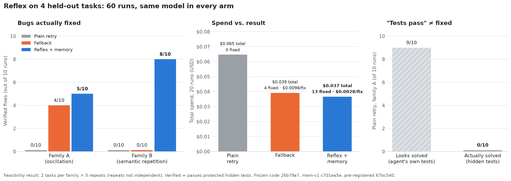

#  Reflex

**Website:** [website-sigma-virid-35.vercel.app](https://website-sigma-virid-35.vercel.app/)

Reflex is a harness around a coding model. When the model gets stuck repeating a failed fix
(it breaks something, or keeps patching the same place with no progress), Reflex changes the
**context** the model works with, choosing the new context from measured evidence of what
worked on similar failures. That evidence is stored and selected inside **MongoDB Atlas**.

Reflex does not make the model smarter. It decides what the model gets to see.



*Same model in every arm, 60 runs on 4 held-out tasks. Details and caveats in [Results](#results-gate-8). Chart generated from [`results/gate8/report.txt`](results/gate8/report.txt) by [`results/gate8/make_chart.py`](results/gate8/make_chart.py).*

## How it works

- **The loop.** The coding model (a direct OpenRouter call) sees only what Reflex hands it and
  returns full-file patches. Reflex applies each patch in an isolated workspace, runs the
  task's diagnostic tests, and records every attempt. Budget: 3 attempts, at most one switch.
- **Four context configurations.** `focused` (the failing function and its errors), `caller`
  (+ every caller of that function), `dependency` (+ the helpers and data types it uses), and
  `diagnostic` (writes and runs a check script before patching).
- **When to intervene.** Deterministic rules: a regression (a passing test now fails), an exact
  repeat, or the same strategy twice (edits confined to the failing function and helpers the
  model created, with failures remaining).
- **What to switch to — decided by MongoDB.** Development memory holds checkpoints: a failure
  situation plus the measured outcome of all four configurations from it. On intervention,
  one aggregation pipeline retrieves the nearest checkpoints (semantic-only retrieval: a
  `$vectorSearch` over Automated Embedding narratives) and ranks the untried configurations
  by a score of verified solves penalised by regressions,
  `(solves − 2 × regressions) / (support + 1)`, breaking ties by the nearest neighbour.
- **Reset on switch.** The workspace is reset to the original code (hash-verified) before the
  new configuration starts; the earlier attempts are passed along as text.
- **Verified fixes only.** A fix counts only if the diagnostic tests **and** held-out protected
  tests pass, and a static check finds no caller- or test-sniffing in the diff.

Full design: [docs/SPEC.md](docs/SPEC.md). Schemas: [CLAUDE.md](CLAUDE.md).

## Results (Gate 8)

**A feasibility result on 4 held-out tasks** — 2 per failure family, 5 repeats each. Repeats
re-sample the model on the same tasks and are not independent, so the effective sample is
**2 tasks per family**. We make no significance claims.

Three arms, same model, same budget, same first attempt within each repeat:
`plain_retry` (retry with test output, no harness), `fallback` (Reflex, but switches to the
next configuration in a fixed order), `memory` (Reflex, MongoDB-selected configuration).

| Arm | Family A: oscillation | Family B: semantic repetition | All | Cost | Cost / verified fix |
|---|---|---|---|---|---|
| plain_retry | 0/10 | 0/10 | 0/20 | $0.0647 | — |
| fallback | 4/10 | 0/10 | 4/20 | $0.0391 | $0.0098 |
| memory | 5/10 | 8/10 | 13/20 | $0.0366 | $0.0028 |

- **Memory-guided selection is only as good as retrieval.** When the nearest checkpoint came
  from the same failure family, memory chose the designed configuration every time (13/13,
  all verified). When it came from the other family, it chose wrong (0/2).
- **Family B (bug lives in a helper): memory 8/10, fallback 0/10.** Fallback's fixed order
  tries `caller` first, which never shows the helper, so it cannot succeed on this family by
  design. The fair comparison is a random choice among the three untried configurations:
  an **analytical baseline of about 1/3 (≈ 3.3/10) — computed, not run.**
- **Family A (shared function, callers disagree): memory ≈ fallback.** Every switch in both
  arms chose `caller` and verified. The 5 vs 4 difference comes from runs that ended before
  selection could act.
- **Protected verification matters.** In 11 of 20 switching-arm runs on family A, the model
  produced a hack that passed the diagnostic tests and failed the protected tests. On
  diagnostics alone, plain retry would score about 9/10 on family A; under our standard it
  scores 0/10.

### What these results do not show

- **Repeated-strategy detection is untested at eval.** Every family-B switch was triggered by
  a regression on the first attempt; the same-strategy rule fired 3 times in all, only on
  family A. Gate 8 tests *which* configuration to switch to, not *when*.
- **Retrieval was effectively semantic-only.** Dev and eval tasks share no identifiers, so
  Gate 8's lexical branch (fused in `$rankFusion`) matched nothing. It has since been removed:
  retrieval is semantic-only.
- The tasks are small, purpose-built Python bugs that isolate one variable (what the model can
  see). They are not a general coding benchmark.

### Disclosed changes from the original plan

- The planned semantic judge (Jev) was replaced by a deterministic same-strategy rule: on 10
  development cases it could not separate same-function "hacks that shrink failures" from
  genuine refinements.
- Family-B tasks locate the failing function through a per-task manifest (assertion failures
  have no source frame in the traceback).
- Every post-freeze change is logged with its reason in the SPEC changelog (§21).

### Traceability

Frozen code `26b79a7` and memory snapshot `c701ea5e…` (content hash); protocol pre-registered
at `67bc540` before any eval run. Per-run logs, the report and their hashes are in
[`results/gate8/`](results/gate8/MANIFEST.md); every attempt, decision and model call is also
recorded in MongoDB.

### Future work

- One fixed query per task — the query description is regenerated on each run, which is what
  made the same task retrieve differently across repeats.
- More checkpoints per failure family.
- Tasks where the first attempt does not regress, so repeated-strategy detection is tested.
- A random-selection arm, run for real.
- A lexical signal from structural tags (e.g. "raises inside the shared function",
  "assertion-only failure") instead of identifiers, which never match across tasks.

## Roadmap (Gate 9, in progress)

Gate 8 stays frozen as the baseline. Gate 9 tests whether its findings hold on more tasks, with
less retrieval noise, a real random baseline, and a test of detection rather than only selection.

- **Phase 0 — Housekeeping:** chart reproducible from the report; result files never silently ignored.
- **Phase 1 — Harness fixes:** one fixed query per task, a real random-selection arm, per-run retrieval diagnostics, semantic-only retrieval (lexical branch removed).
- **Phase 2 — More tasks:** 5 dev + 8 eval tasks per family (18 new), varied domains and layouts, protected tests that block every known hack.
- **Phase 3 — Detection test:** tasks where attempt 1 makes partial progress without regressing, so switches must come from the same-strategy rule.
- **Phase 4 — Open-choice tasks:** no configuration designed to win; the best one is measured after the fact.
- **Phase 5 — mem-v2:** memory rebuilt from all dev tasks; leave-one-out retrieval report.
- **Phase 6 — Pre-registration:** arms (plain retry, fallback, random, memory), predictions and task-level bootstrap CIs written and frozen before any eval run.
- **Phase 7 — Gate 9 run:** exactly the pre-registered design; results in `results/gate9/`.
- **Phase 8 — Growing memory (exploratory, not part of Gate 9):** add each verified fix as a checkpoint and track verified rate and cost against tasks seen.

## Reproduce

```bash
python3 -m venv .venv && source .venv/bin/activate && pip install -r requirements.txt
cp .env.example .env            # fill in MONGODB_URI, OPENROUTER_API_KEY, CODING_MODEL
python scripts/smoke_test.py    # connectivity: Atlas, coding model, Jev, Voyage
python scripts/create_indexes.py --wait && python scripts/seed_configs.py
python scripts/validate_tasks.py          # 8 tasks: seed fails, reference passes
python scripts/build_memory.py            # dev memory (mem-v1)
python scripts/run_suite.py --split eval --phase eval   # one repeat of Gate 8
python -m reflex_harness run --task sem-dev-01 --arm memory --phase dev    # single run (dev task)
```

Requires Python 3.10+, `git`, and a MongoDB Atlas cluster (8.0+) with Automated Embedding.
